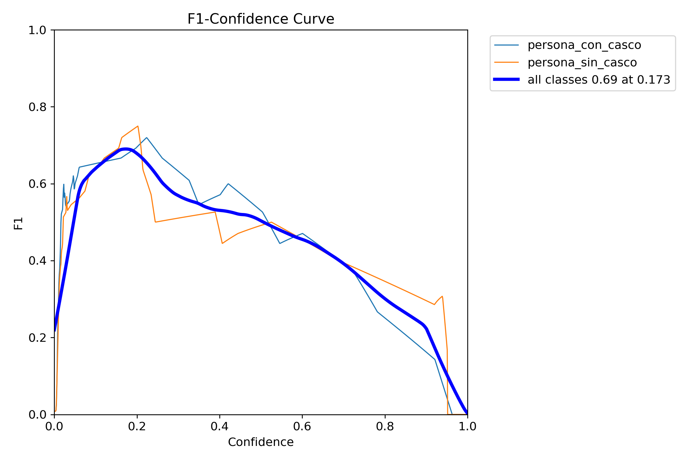
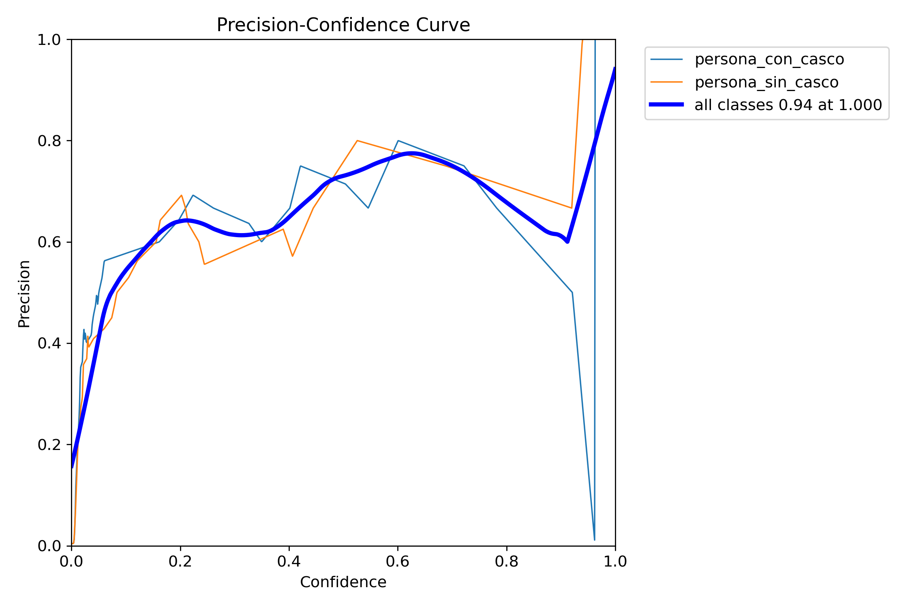
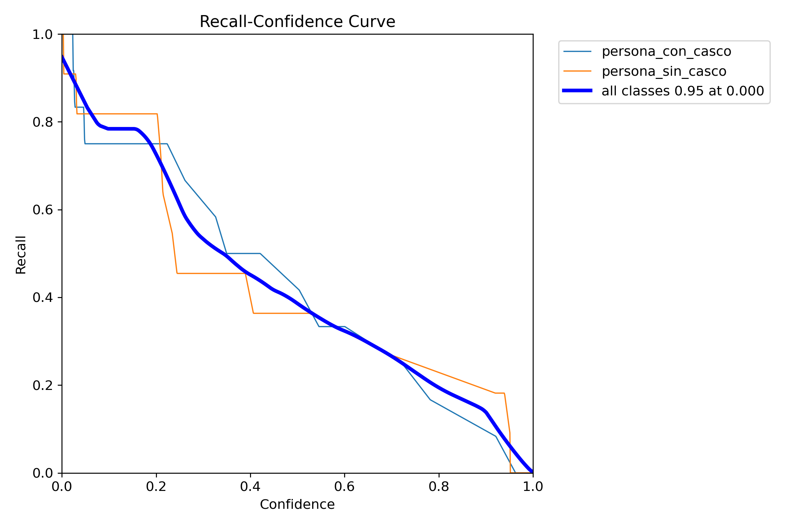
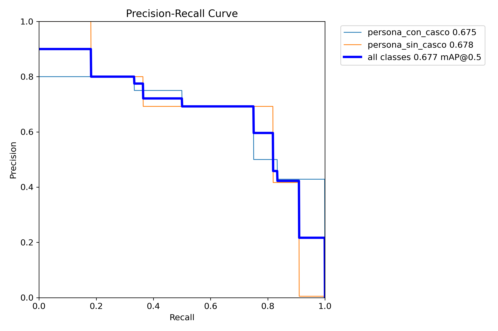
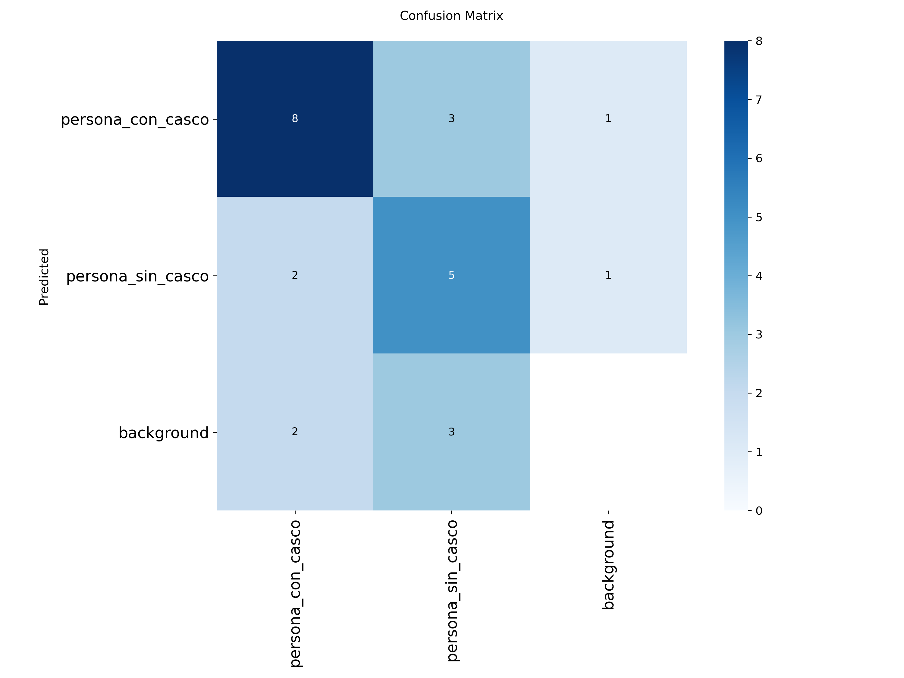
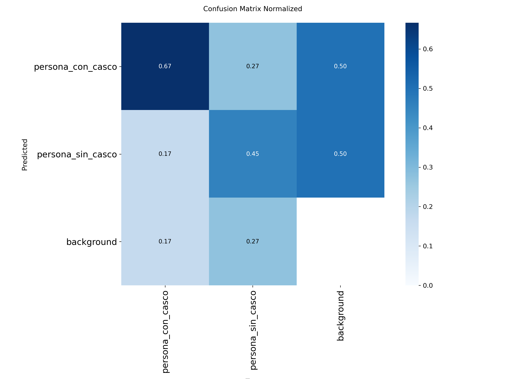
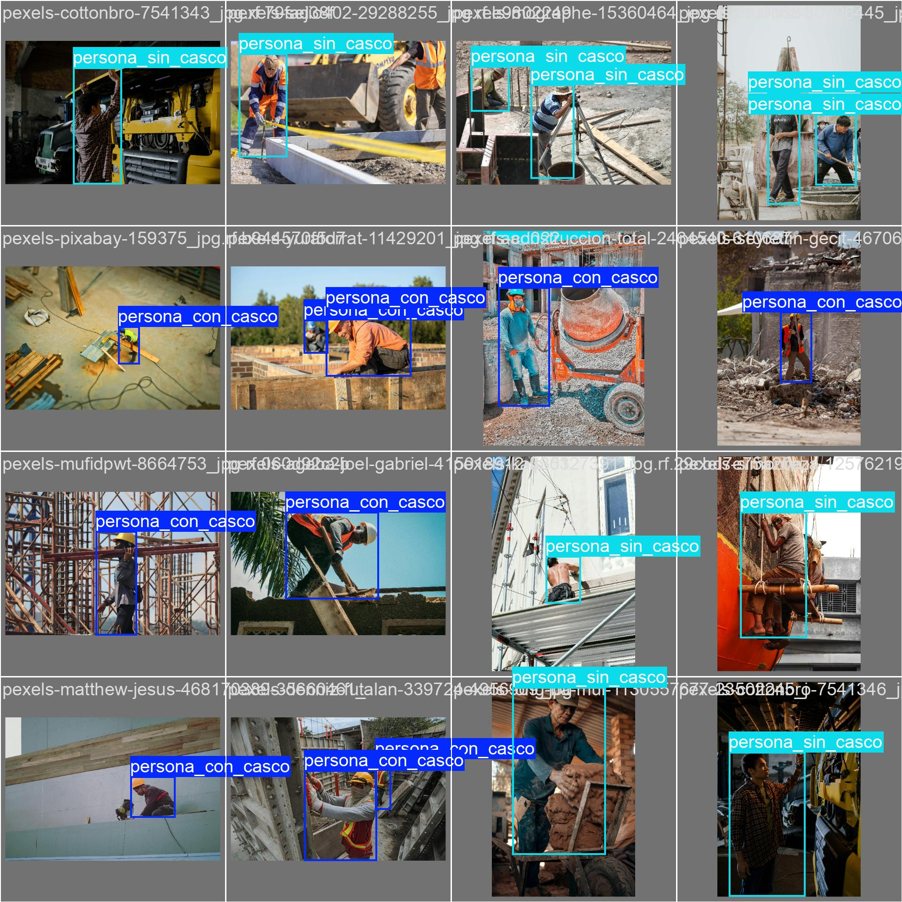
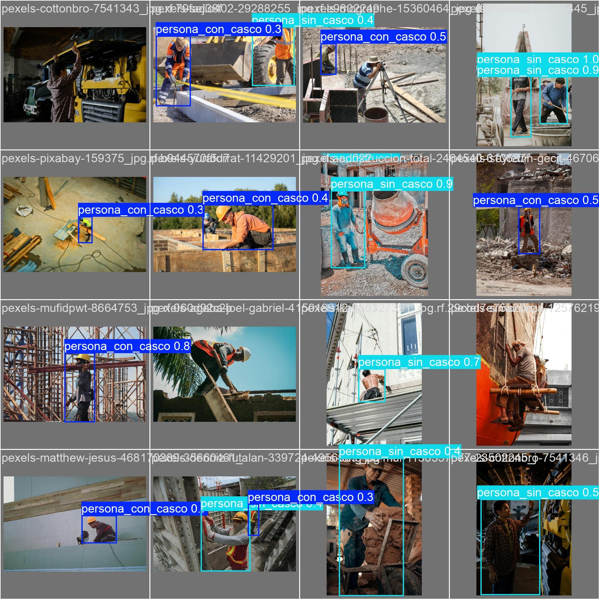
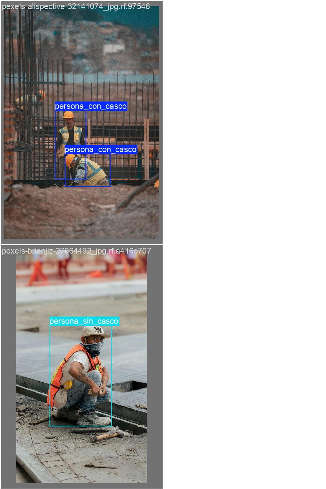
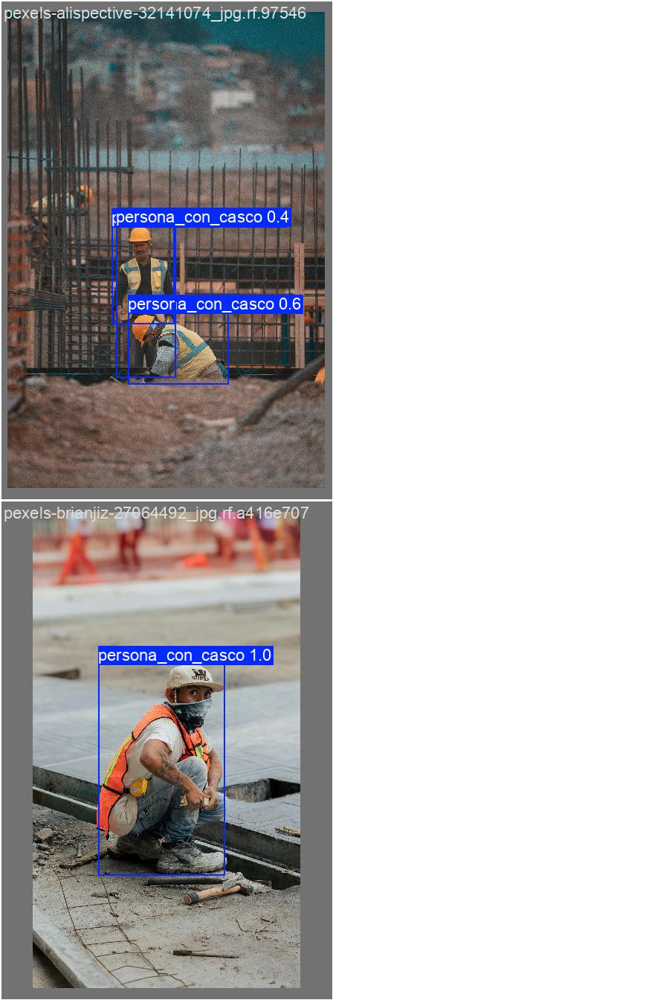

Detección de cascos de seguridad en entornos de construcción mediante YOLOV8: Prototipo de visión por computadora para seguridad en el sector AECO

1.	Introducción y contexto
Este repositorio documenta el desarrollo de un modelo de Visión por Computadora (Computer Vision) para detectar el uso de casco de seguridad en personas, como parte de la tarea M4T3 del Máster en Inteligencia Artificial para Arquitectura y Construcción (MAIC) de Zigurat Global Institute of Technology. El objetivo práctico es entrenar y evaluar un detector de objetos basado en YOLOv8 para clasificar personas en dos categorías: con casco y sin casco, y analizar el desempeño del modelo para identificar limitaciones, sesgos y oportunidades de mejora.

2.	Resumen de resultados
Se desarrolló un prototipo de detección automática del uso de casco de seguridad en trabajadores utilizando un modelo de visión por computadora basado en YOLOv8n. El modelo fue entrenado con un dataset construido en Roboflow a partir de imágenes públicas de Pexels.
Resultados principales del entrenamiento:
- **Dataset final:** 136 imágenes anotadas.
- **Clases:** persona_con_casco / persona_sin_casco.
- **mAP@0.5:** 0.582
- **F1 máximo:** ~0.59
Conclusiones principales:
a. El modelo es capaz de detectar correctamente la mayoría de los casos evidentes de uso y no uso de casco en escenarios de obra.
b. Los errores más frecuentes se producen cuando aparecen **gorras, sombreros o cascos parcialmente ocultos**, lo que introduce ambigüedad visual.
c. El incremento del dataset introdujo mayor variabilidad y casos límite, lo que redujo ligeramente el mAP pero generó una evaluación más exigente y realista del modelo.

3.	Descripción del problema
En entornos de construcción e infraestructura (sector AECO: Architecture, Engineering, Construction & Operations), el uso de Equipo de Protección Personal (EPP) es un requisito esencial para reducir la probabilidad y severidad de accidentes. Aun cuando existen procedimientos y supervisión, el control visual manual puede ser inconsistente, costoso y difícil de escalar. Un sistema automatizado de detección de casco puede apoyar en: monitoreo preventivo, auditorías de seguridad, generación de evidencia y alertas tempranas. En esta tarea, se modela el problema como detección/clasificación de objetos, donde el objeto base es la persona y la etiqueta describe si porta casco.
El reto principal no es únicamente detectar una persona, sino discriminar correctamente escenarios ambiguos: cascos parcialmente visibles, ángulos laterales, oclusiones, distancia a cámara, variaciones de iluminación, y elementos visualmente similares al casco (gorras, sombreros, bandanas, capuchas, etc.).

4.	Criterio de éxito del prototipo
Dado que este proyecto utiliza un dataset pequeño y se desarrolla con fines académicos, el objetivo no es alcanzar desempeño industrial sino demostrar la viabilidad del enfoque de visión por computadora para el problema planteado. En este contexto, se considera exitoso un modelo capaz de detectar correctamente la mayoría de los casos evidentes de uso y no uso de casco, alcanzando métricas razonables de precisión y recall y permitiendo identificar claramente las limitaciones del dataset y del modelo.

5.	Definición de clases del dataset
5.1 Clases utilizadas
El dataset incluye dos clases para detección:
• persona_con_casco: Persona portando casco de seguridad (hard hat / safety helmet).
• persona_sin_casco: Persona sin casco. En esta clase pueden aparecer personas con gorra, sombrero, bandana o mascarilla, según la selección de imágenes realizada para aumentar la dificultad y evitar confusiones.
5.2 Reglas de etiquetado
Para mantener consistencia en las anotaciones, se siguieron los siguientes criterios de etiquetado:
• Las cajas delimitadoras (bounding boxes) se dibujan alrededor de la persona visible en la imagen.
• Se clasifica como persona_con_casco únicamente cuando el casco de seguridad es claramente visible.
• Si la persona utiliza gorra, sombrero, pañuelo, capucha u otro accesorio en la cabeza que no corresponde a un casco industrial, se etiqueta como persona_sin_casco.
• En casos donde el casco aparece parcialmente visible pero identificable, se mantiene la etiqueta persona_con_casco.
Nota: En YOLO, además de las clases anotadas, existe la categoría implícita de fondo (background) que representa todo lo que no es un objeto anotado. En métricas como la matriz de confusión, suele aparecer como una fila/columna adicional para contabilizar detecciones perdidas o predicciones sin correspondencia.

6.	Dataset
6.1 Origen de las imágenes
Las imágenes fueron obtenidas de Pexels (material libre), y el dataset fue construido y gestionado con Roboflow para anotación, versionado y exportación al formato YOLO. Se trabajó con dos iteraciones del dataset con el fin de comparar desempeño al incrementar el número de ejemplos y aumentar la variabilidad de escenas.
6.2 Versiones del dataset
• Entrenamiento 1 (Train 1): 89 imágenes anotadas (dataset inicial).
• Entrenamiento 2 (Train 2): 136 imágenes anotadas (dataset ampliado).
6.3 División del Dataset
Partición (split) del dataset: 70% entrenamiento / 20% validación / 10% prueba. Esta división se mantuvo para facilitar la comparación entre versiones.
URL del dataset (Roboflow, versión pública): https://app.roboflow.com/lisardos-workspace/casco_v0_test/3
6.4 Ejemplos de anotación del dataset (Roboflow)
Las siguientes imágenes muestran ejemplos reales del proceso de anotación realizado en Roboflow. En cada caso se dibuja una caja delimitadora (bounding box) alrededor de la persona visible en la escena y se asigna la etiqueta correspondiente: persona_con_casco o persona_sin_casco. Estas anotaciones constituyen la base del dataset utilizado para el entrenamiento del modelo YOLOv8.

    

7.	Modelo y entorno de entrenamiento
7.1 Arquitectura del modelo (YOLOv8)
Arquitectura: YOLOv8 (Ultralytics). YOLO (You Only Look Once) es una familia de detectores de objetos de una sola etapa que predicen cajas delimitadoras (bounding boxes) y clases de manera eficiente. YOLOv8 integra mejoras de backbone/neck/head, estrategias de entrenamiento y utilidades de evaluación respecto a versiones previas.
7.2 Entorno de ejecución
Entorno de ejecución: Google Colab con GPU habilitada. Framework: Ultralytics YOLOv8. El flujo general incluye: descarga/exportación del dataset desde Roboflow, definición del archivo data.yaml, entrenamiento, y posterior evaluación/visualización de métricas y ejemplos.
7.3 Notebooks utilizados (E1 y E50)
Sobre los notebooks E1 y E50:
En este repositorio se usan dos notebooks para registrar corridas con distinta duración de entrenamiento. El sufijo “E1” indica una corrida rápida de 1 época (epoch) usada típicamente como verificación de pipeline (validar que el dataset se carga bien, que el entrenamiento inicia, que las rutas y clases están correctas, etc.).
El sufijo “E50” corresponde a la corrida principal de entrenamiento con 50 épocas. Una época equivale a una pasada completa sobre el conjunto de entrenamiento (con mini-batches). Aumentar épocas puede mejorar el ajuste del modelo, pero también incrementa riesgo de sobreajuste si el dataset es pequeño o si hay ruido en anotaciones.

8.	Resultados y métricas
8.1 Métricas utilizadas
Se reportan métricas estándar de detección: Precision (precisión), Recall (sensibilidad), F1-score y mAP@0.5. En particular, mAP@0.5 (mean Average Precision con IoU=0.5) resume el desempeño de precisión/recall a diferentes umbrales, y es un indicador común para comparar detectores.
En este proyecto se prioriza el reporte de mAP@0.5 por tratarse de un ejercicio académico con dataset reducido. No obstante, en evaluaciones más exigentes es recomendable reportar también mAP@0.5:0.95 (métrica tipo COCO), ya que esta considera múltiples umbrales de IoU y ofrece una visión más estricta del desempeño del detector.
También se recomienda reportar mAP50–95 (mAP@0.5:0.95) como métrica más estricta; en este prototipo se prioriza mAP@0.5 por el tamaño y naturaleza del dataset, pero mAP50–95 se incorporaría en una iteración posterior para una evaluación más robusta.
8.2 Resultados Train 1 y Train 2
Resumen numérico:
• Entrenamiento 1 (89 imágenes): mAP@0.5 = 0.677 ; F1 máximo ≈ 0.69.
• Entrenamiento 2 (136 imágenes): mAP@0.5 = 0.582 ; F1 máximo ≈ 0.59.

9.	Análisis visual del entrenamiento
Curvas por umbral de confianza (Train 1)
Las curvas por confianza muestran cómo cambian las métricas cuando se ajusta el umbral mínimo de confianza para aceptar una detección. Un umbral más bajo tiende a aumentar el recall (se aceptan más detecciones), pero puede bajar precision (más falsos positivos). Un umbral más alto tiende a aumentar precision, pero baja recall (se pierden objetos verdaderos). Elegir el umbral es una decisión de operación: por ejemplo, en seguridad puede preferirse mayor recall (detectar más casos sin casco) a costa de más alertas falsas, dependiendo del costo del error.
 

Curva Precision–Recall y mAP (Train 1)
La curva Precision–Recall resume el intercambio entre precisión y sensibilidad para diferentes umbrales. El área bajo esta curva (AP) por clase y su promedio (mAP) reflejan el desempeño global. Una curva más cercana a la esquina superior derecha indica mejor desempeño (alta precisión y alto recall).
 

Matriz de confusión (Train 1)
La matriz de confusión permite observar patrones de error: confundir persona_con_casco con persona_sin_casco (o viceversa), detecciones perdidas (predichas como background) y falsos positivos (predicciones que no corresponden a ningún objeto real). La versión normalizada facilita comparar proporciones.
 

Ejemplos cualitativos (validación)
Además de métricas, es importante revisar ejemplos visuales: etiquetas reales vs predicciones del modelo. Esto ayuda a identificar: oclusiones, cajas mal ajustadas, confusiones por accesorios, personas pequeñas en la imagen, y escenas con iluminación extrema. A continuación se incluyen ejemplos de batch de validación (si están disponibles).
 

RESULTADOS DETALLADOS – TRAIN 2 (136 IMÁGENES)
En esta sección se presentan las gráficas correspondientes al segundo entrenamiento (Train 2), realizado con un dataset ampliado a 136 imágenes. Se incluyen curvas de F1, Precision, Recall, Precision-Recall y matrices de confusión, así como ejemplos visuales del conjunto de validación.
Curvas por Umbral de Confianza (Train 2)
 
Figura: F1 vs Confidence (Train 2).
 
Figura: Precision vs Confidence (Train 2).
 
Figura: Recall vs Confidence (Train 2).
Curva Precision–Recall (Train 2)
 
Figura: Precision–Recall con mAP@0.5 (Train 2).
Matriz de Confusión (Train 2)
 
Figura: Matriz de confusión (valores absolutos, Train 2).
 
Figura: Matriz de confusión normalizada (Train 2).
Ejemplos Visuales – Validación (Train 2)
 
Figura: Etiquetas reales (batch 0, Train 2).
 
Figura: Predicciones del modelo (batch 0, Train 2).
 
Figura: Etiquetas reales (batch 1, Train 2).
 
Figura: Predicciones del modelo (batch 1, Train 2).

10.	Análisis técnico de desempeño
10.1 Comparación estructurada entre Train 1 y Train 2
Para facilitar el análisis cuantitativo, se presenta una comparación directa entre ambas iteraciones del dataset y entrenamiento:
Entrenamiento	Nº Imágenes	mAP@0.5	F1 Máximo	Observación General
Train 1	89	0.677	~0.69	Dataset inicial, menor variabilidad
Train 2	136	0.582	~0.59	Mayor variabilidad y casos límite
Aunque el tamaño del dataset aumentó en aproximadamente un 53% (de 89 a 136 imágenes), las métricas globales disminuyeron. Este comportamiento es coherente con un aumento en la complejidad del conjunto de datos y no necesariamente indica deterioro del modelo.
En particular:
•	Se incrementó la variabilidad visual (distancia, iluminación, accesorios).
•	Se añadieron casos límite (gorras, sombreros, escenas ambiguas).
•	Se introdujo mayor dificultad semántica para distinguir entre casco industrial y accesorios similares.
Por lo tanto, el descenso de mAP debe interpretarse como una evaluación más exigente del modelo y no como un fallo estructural del entrenamiento.
Interpretación complementaria
El incremento de datos no garantizó una mejora inmediata en las métricas globales. En contextos de visión por computadora con datasets pequeños, es común que la introducción de mayor variabilidad inicial reduzca temporalmente el mAP mientras el modelo comienza a enfrentarse a escenarios más complejos. Este comportamiento no necesariamente indica deterioro del modelo, sino un aumento en la exigencia del conjunto de validación.
10.2 Análisis técnico de desempeño (por qué Train 2 puede bajar)
Que Train 2 (136 imágenes) tenga métricas menores que Train 1 (89 imágenes) no significa necesariamente que el modelo “empeoró”; puede significar que la evaluación se volvió más exigente. Las causas más probables en este tipo de tarea son:
a) Mayor variabilidad y casos límite: al agregar escenas con gorras/sombreros/bandanas, el modelo enfrenta confusiones más difíciles. Esto suele bajar mAP en el corto plazo, pero es deseable porque mejora la robustez a futuro.
b) Desbalance de clases o de dificultad: aunque el conteo total aumente, puede aumentar más una clase que la otra, o aumentar imágenes “difíciles” en validación/prueba. En ese caso, la métrica baja aunque el entrenamiento sea correcto.
c) Consistencia de anotación: variaciones en el criterio de etiquetado (por ejemplo, cuándo considerar casco visible, cómo dibujar la caja, si incluir personas parcialmente visibles) introducen ruido. Con datasets pequeños, el ruido impacta mucho.
d) Sobreajuste/infraajuste: con pocas imágenes, el modelo puede memorizar patrones de Train 1. Al introducir nuevas imágenes, se requiere más data y/o más ajustes de hiperparámetros para generalizar.
e) Umbral operativo y NMS: parte de la “calidad” percibida depende del umbral de confianza y del Non-Maximum Suppression. Un umbral no óptimo puede penalizar F1 o hacer que algunas detecciones se pierdan.
f) Desbalance cuantitativo entre clases
En el dataset ampliado (Train 2), la distribución de clases quedó estructurada de la siguiente manera:
•	persona_con_casco: 65 instancias
•	persona_sin_casco: 120 instancias
Esto representa casi una proporción 1:2, donde la clase “sin casco” es significativamente dominante.
Implicaciones técnicas del desbalance:
1.	El modelo puede desarrollar sesgo hacia la clase mayoritaria.
2.	Se incrementa la probabilidad de falsos positivos en la clase dominante.
3.	El mAP global puede verse afectado si la clase minoritaria tiene menor recall.
4.	La matriz de confusión puede mostrar mayor inestabilidad en predicciones cruzadas.
En datasets pequeños, el impacto del desbalance es más pronunciado, ya que el modelo dispone de menos ejemplos para aprender características robustas de la clase minoritaria.
Este factor puede contribuir parcialmente a la reducción observada en mAP@0.5 en Train 2, aun cuando el número total de imágenes aumentó.

11.	Análisis técnico de errores del modelo
En esta sección se presenta un análisis técnico detallado de los principales errores observados en el entrenamiento Train 2 (136 imágenes, 50 épocas). El objetivo es identificar patrones de fallo, formular hipótesis plausibles desde el punto de vista de visión por computadora y establecer mejoras concretas basadas en evidencia.
11.1 Falsos positivos
1. Caso: Gorra clasificada como casco
En múltiples ejemplos, trabajadores con gorra fueron clasificados como persona_con_casco, aun cuando el etiquetado real correspondía a persona_sin_casco.

Hipótesis técnica:
El modelo parece estar aprendiendo correlaciones visuales débiles asociadas a la forma redondeada en la cabeza, colores claros (amarillo/beige) y contraste fuerte con el entorno. En datasets pequeños, es común que el modelo aprenda patrones superficiales (color y silueta) en lugar de características estructurales del objeto.
Problema identificado:
El dataset no contiene suficientes ejemplos negativos variados que representen:
- Gorras de diferentes colores
- Sombreros con ala
- Trapos o pañuelos en la cabeza
- Capuchas o cascos no industriales
2. Caso: Sombrero de ala interpretado como casco
En escenas con sombreros de ala ancha o protección solar, el modelo generó predicciones de persona_con_casco.
Hipótesis técnica:
El modelo está utilizando como característica principal la silueta circular o el contorno superior rígido, sin distinguir adecuadamente entre estructura rígida industrial (casco de seguridad) y materiales textiles o flexibles.
3. Caso: Persona pequeña o lejana en la imagen
Cuando la persona aparece a mayor distancia de la cámara, la clasificación tiende a degradarse o cambiar de clase con baja confianza.
Hipótesis técnica:
La reducción en tamaño efectivo del objeto en pixeles afecta la capacidad del modelo para distinguir detalles finos del casco. El modelo YOLOv8n, por su tamaño reducido, puede no tener suficiente capacidad para generalizar correctamente en objetos pequeños.
11.2 Falsos negativos
1. Casco parcialmente oculto
En escenas donde el casco está parcialmente cubierto por postura, herramientas u otros trabajadores, el modelo no logra clasificar correctamente como persona_con_casco.
Hipótesis técnica:
Falta de ejemplos con cascos parcialmente visibles, perfiles laterales y posturas agachadas o inclinadas.
2. Cascos con variación de color
El dataset contiene una proporción alta de cascos amarillos brillantes. En ejemplos con cascos blancos, naranja tenue o con polvo, el recall disminuye.
Hipótesis técnica:
Sesgo de color en el dataset. El modelo puede estar asociando “casco” con color específico más que con forma estructural.
3. Personas parcialmente fuera de cuadro
En imágenes donde la persona está cortada por el borde del encuadre, el modelo pierde robustez en la clasificación.
11.3 Hipótesis técnicas
El entrenamiento no incluye suficientes ejemplos con personas parcialmente visibles, lo que afecta la generalización en situaciones reales de cámara fija o CCTV.
El descenso de mAP en Train 2 no necesariamente indica un deterioro del modelo, sino un aumento en la complejidad del dataset. Al incorporar casos límite (gorras, trapos, mayor distancia), la evaluación se vuelve más exigente.
El problema principal identificado no es geométrico ni de definición de bounding boxes, sino semántico: el modelo está aprendiendo correlaciones visuales superficiales (forma y color) en lugar del concepto estructural de casco rígido industrial.
Este comportamiento es esperable en datasets pequeños y puede mitigarse mediante:
- Incremento significativo del tamaño del dataset (idealmente 250–300 imágenes o más).
- Inclusión de ejemplos negativos duros (hard negatives) con gorras, sombreros, capuchas y accesorios similares.
- Mayor diversidad de colores y tipos de casco.
- Revisión de balance por clase y por nivel de dificultad.
- Evaluación de modelos de mayor capacidad (por ejemplo, YOLOv8s).

12.	Resultados de Inferencia en imágenes nuevas
El siguiente análisis presenta una revisión cualitativa de los resultados obtenidos al ejecutar el modelo de detección de cascos de seguridad sobre un conjunto de imágenes de prueba. El objetivo de esta evaluación es observar el comportamiento del modelo en diferentes escenarios y analizar tanto los aciertos como las posibles limitaciones del sistema de detección.
12.1 Imagen 1
En esta imagen se observa a una persona trabajando en el motor de un camión dentro de un taller mecánico. No se aprecia el uso de casco de seguridad. El modelo no detectó ninguna persona en la escena. Una posible explicación es que el trabajador se encuentra parcialmente oculto y de espaldas a la cámara. Además, el modelo probablemente fue entrenado principalmente con imágenes de obras de construcción, por lo que su capacidad de detección puede disminuir en contextos diferentes como talleres mecánicos.
12.2 Imagen 2
En esta escena aparece un trabajador caminando dentro de una estructura de andamios. El modelo detectó dos instancias clasificadas como 'persona_con_casco'. Una de las detecciones presenta una confianza alta (0.93) y corresponde correctamente al trabajador visible en la imagen. La segunda detección muestra una confianza menor (0.35) y posiblemente corresponde a un falso positivo generado por la complejidad de las estructuras metálicas del fondo. Este resultado sugiere que el modelo puede confundirse con patrones estructurales presentes en el entorno.
12.3 Imagen 3
El modelo identificó una instancia clasificada como 'persona_sin_casco' con una confianza de 0.52. En la imagen se observa un trabajador que lleva un pañuelo en la cabeza y gafas de protección, pero no utiliza casco de seguridad. La predicción puede considerarse correcta, aunque el nivel de confianza moderado indica que el modelo presenta cierta incertidumbre cuando la cabeza está cubierta por elementos distintos al casco.
12.4 Imagen 4
Esta imagen presenta una escena conceptual en la que una persona interactúa con un holograma digital. El modelo no generó ninguna detección. Este resultado es adecuado, ya que la escena no corresponde a un entorno de construcción ni contiene trabajadores con cascos de seguridad.
12.5 Imagen 5
El modelo detectó una instancia clasificada como 'persona_sin_casco' con una confianza de 0.91. Sin embargo, el trabajador en la imagen sí lleva un casco de seguridad amarillo. Este caso representa un error de clasificación. Una posible causa es que el trabajador se encuentra inclinado hacia adelante, lo que provoca que el casco sea parcialmente ocultado y dificulte su reconocimiento por parte del modelo.
12.6 Conclusiones de inferencia.
En términos generales, el modelo demuestra capacidad para identificar trabajadores con y sin casco en diferentes escenas relacionadas con actividades de construcción. No obstante, el análisis también revela algunas limitaciones. La precisión del modelo disminuye cuando las personas aparecen parcialmente ocultas, cuando el casco se observa desde ángulos poco comunes o cuando existen estructuras complejas en el fondo que pueden generar falsas detecciones. Para mejorar el desempeño del modelo sería recomendable ampliar el conjunto de datos de entrenamiento, incorporar más ejemplos de cascos desde diferentes perspectivas y aumentar la diversidad de contextos laborales representados en el dataset.

13.	Reproducibilidad
13.1 Cómo ejecutar el proyecto
Para reproducir el entrenamiento y evaluación:
1) Abrir los notebooks dentro de la carpeta /notebooks en GitHub.
2) Abrir cada notebook en Google Colab (opción ‘Open in Colab’ o cargándolo manualmente).
3) En Colab: Runtime → Change runtime type → seleccionar GPU.
4) Ejecutar celdas en orden (de arriba a abajo), verificando que el enlace con Roboflow y la ruta al data.yaml sean correctas.
5) Al finalizar, revisar las carpetas de resultados generadas (curvas, matriz de confusión, ejemplos de validación).
13.2 Checklist de Reproducibilidad Técnica
Para garantizar que un tercero pueda reproducir los resultados sin ambigüedades, se documentan los parámetros y versiones utilizadas en el entrenamiento principal (E50):
Dataset
•	Plataforma: Roboflow
•	Proyecto: casco_v0_test
•	Versión utilizada: v3
•	Formato exportado: YOLOv8
•	Split: 70% entrenamiento / 20% validación / 10% prueba
Modelo
•	Arquitectura: YOLOv8n (Ultralytics)
•	Pesos base: yolov8n.pt
Parámetros principales
•	Epochs: 50
•	Image size (imgsz): 640
•	Batch size: valor determinado automáticamente por Ultralytics según la memoria disponible de la GPU en Google Colab (configuración por defecto).
Entorno
•	Plataforma: Google Colab
•	Aceleración: GPU
•	Framework: Ultralytics YOLOv8 valor determinado automáticamente por Ultralytics según la memoria disponible de la GPU en Google Colab (configuración por defecto).
•	Versión de Ultralytics utilizada: 8.x (instalada mediante pip install ultralytics en Google Colab).
•	Instalación: pip install ultralytics
Nota sobre verificación rápida
El notebook E1 (1 epoch) se incluye como verificación de pipeline para comprobar carga correcta del dataset, rutas y configuración antes de ejecutar el entrenamiento completo.
13.3 Nota de prueba de reproducibilidad
El entrenamiento completo (E50) fue ejecutado exitosamente en Google Colab con GPU habilitada.
Condiciones de ejecución:
•	Entorno: Google Colab
•	Aceleración: GPU (según disponibilidad automática de Colab)
•	Tiempo estimado de ejecución (50 épocas, YOLOv8n, 136 imágenes): aproximadamente 8–15 minutos
•	Notebook E1 incluido para verificación rápida del pipeline (1 epoch)
La ejecución end-to-end incluye:
1.	Descarga del dataset desde Roboflow.
2.	Entrenamiento del modelo.
3.	Generación automática de métricas (Precision, Recall, mAP).
4.	Generación de curvas y matrices de confusión.
5.	Exportación de pesos entrenados.
Esto permite que cualquier tercero pueda reproducir los resultados utilizando únicamente el repositorio y Google Colab, sin instalaciones locales.

14.	Limitaciones del dataset y del modelo
Limitaciones actuales (importantes para interpretar resultados):
• Tamaño del dataset: 89–136 imágenes es un tamaño pequeño para un detector robusto en condiciones reales.
• Distribución y sesgo: las imágenes provienen de un banco de imágenes (Pexels), lo que puede no reflejar cámaras reales de obra (ángulos fijos, CCTV, resolución variable, polvo, vibración, etc.).
• Iluminación y clima: escenas con poca luz, contraluz fuerte, lluvia, neblina, polvo, o lentes mojados pueden degradar el desempeño.
• Oclusiones: casco parcialmente oculto por la postura, herramientas, manos, otros trabajadores, o por el propio encuadre.
• Tamaño del objeto: personas lejos de la cámara (muy pequeñas en pixeles) reducen la detectabilidad del casco.
• Objetos confundibles: gorras, sombreros, capuchas, bandanas, casco de distinto color o forma, etc.
Limitaciones propias del enfoque: el modelo se entrenó para dos clases y no valida el cumplimiento completo de EPP (chaleco, guantes, lentes), ni interpreta contexto (por ejemplo, si la persona está dentro de zona de riesgo).
Para lo que NO debe usarse este modelo 
Este modelo es un prototipo académico y NO debe usarse como único mecanismo de seguridad o cumplimiento normativo. En particular, no debe utilizarse para:
• Toma de decisiones críticas sin supervisión humana (por ejemplo, sanciones, despidos, acceso físico a zonas restringidas).
• Operación en condiciones no representadas en el dataset (noche, lluvia intensa, cámaras térmicas, CCTV de baja resolución, etc.) sin validación adicional.
• Casos donde la privacidad o regulación requiera procesos formales (retención de video, consentimiento, protección de datos) sin cumplir normativa aplicable.
Antes de cualquier uso operativo, se requiere: dataset propio del entorno real, evaluación con métricas y criterios del proyecto, pruebas piloto, análisis de riesgos, y un plan de calibración/monitoreo del modelo.

15.	Próximos pasos 
Para mejorar el desempeño y robustez, sería recomendable:
• Incrementar el dataset a 150–200 imágenes como mínimo, idealmente más (500+), incluyendo cámaras y escenas reales de obra.
• Aumentar diversidad: diferentes cascos, colores, distancias, ángulos (frontal/lateral/superior), y condiciones de iluminación/clima.
• Revisar y estandarizar criterios de anotación (guía de etiquetado) y re-anotar ejemplos ambiguos.
• Analizar el balance por clase y por dificultad, y usar estrategias de muestreo si es necesario.
• Ajustar hiperparámetros (learning rate, batch size, augmentations) y comparar tamaños de modelo (n, s, m) según recursos.
• Evaluar métricas adicionales (mAP@0.5:0.95, por clase, por tamaños) y elegir un umbral operativo según caso de uso (F1 vs recall).
• Considerar ampliar el alcance: detección de otros EPP (chaleco, lentes) o zonas de riesgo, siempre con dataset adecuado.

16.	Marco de Gobernanza y Uso Responsable del Modelo
Con el objetivo de documentar de forma estructurada las consideraciones éticas, técnicas y regulatorias asociadas al desarrollo de este modelo, se establecen los siguientes criterios de gobernanza:
1. Privacidad y consentimiento
El dataset utilizado fue construido a partir de imágenes públicas disponibles en la plataforma Pexels, bajo condiciones de uso libre. No se emplearon imágenes privadas ni capturas de entornos reales de obra sin consentimiento explícito.
El proyecto no recolecta ni almacena datos personales adicionales. No se realiza identificación de individuos ni tratamiento de información sensible.
2. Principio de minimización de datos
El modelo está diseñado exclusivamente para detectar la presencia o ausencia de casco de seguridad en una persona visible en la imagen.
No realiza:
•	Reconocimiento facial.
•	Identificación biométrica.
•	Perfilado de individuos.
•	Seguimiento de personas a través del tiempo.
El alcance del modelo se limita estrictamente a la clasificación visual del uso de casco.
3. Riesgos asociados a errores del modelo
En cualquier sistema de detección automática existen dos tipos principales de error:
Falsos Positivos (FP): Clasificar incorrectamente a una persona como sin casco cuando sí lo porta.
Falsos Negativos (FN): No detectar a una persona sin casco.
Desde una perspectiva de seguridad industrial, los falsos negativos representan el riesgo más crítico, ya que podrían permitir condiciones inseguras no identificadas.
Por esta razón, cualquier implementación real debería definir explícitamente el balance entre Precision y Recall según el costo operativo del error.
4. Declaración formal de limitaciones
El modelo presenta las siguientes limitaciones:
•	Fue entrenado con un dataset reducido (89–136 imágenes).
•	Las imágenes provienen de banco de imágenes y no de cámaras reales de obra.
•	No ha sido validado en condiciones operativas reales.
•	No cuenta con certificación técnica ni evaluación normativa.
•	No debe utilizarse como sistema autónomo de seguridad.
Cualquier uso fuera del ámbito académico requeriría validación técnica adicional con datos propios del entorno real, pruebas piloto controladas y análisis formal de riesgos.

17.	LICENCIA Y CONDICIONES DE USO
Este modelo de detección de uso de casco fue desarrollado exclusivamente con fines académicos como parte del programa MAIC (Máster en Inteligencia Artificial para Arquitectura y Construcción). Se trata de un prototipo experimental utilizado para análisis técnico, aprendizaje y evaluación de métricas en visión por computadora.
El modelo NO ha sido probado en condiciones reales de obra ni validado en entornos operativos. No cuenta con certificaciones, auditorías técnicas ni procesos formales de validación industrial.
En consecuencia, este modelo NO debe utilizarse como sistema de seguridad para trabajadores en entornos reales, ni como mecanismo único de supervisión, control o toma de decisiones relacionadas con seguridad laboral.
El uso del modelo fuera del ámbito académico es completamente responsabilidad de la persona u organización que decida implementarlo. El autor del proyecto y el programa MAIC no asumen responsabilidad por daños, pérdidas, accidentes o consecuencias derivadas del uso directo o indirecto del modelo.
CONDICIONES ADICIONALES PARA USO FUERA DEL ÁMBITO ACADÉMICO
Cualquier implementación en un entorno real debería estar precedida por: validación técnica rigurosa con datos propios del entorno objetivo, pruebas piloto controladas, supervisión humana constante, evaluación de riesgos, cumplimiento normativo en materia de seguridad industrial y cumplimiento de legislación vigente en protección de datos y privacidad.
REFERENCIAS A LICENCIAS ABIERTAS COMUNES EN PROYECTOS DE IA
En proyectos académicos y de investigación en inteligencia artificial suelen emplearse licencias abiertas como: MIT License, Apache License 2.0, BSD License o Creative Commons (por ejemplo CC BY-NC-SA). Estas licencias permiten reutilización con ciertas condiciones y generalmente incluyen cláusulas de exención de responsabilidad.
En línea con dichas prácticas, este proyecto se entrega sin garantía expresa o implícita de funcionamiento, rendimiento o adecuación para un propósito específico.
CLÁUSULA RESUMIDA DE EXENCIÓN DE RESPONSABILIDAD
Este proyecto se entrega exclusivamente con fines académicos. No se garantiza su desempeño en entornos reales, no constituye un sistema certificado de seguridad, y cualquier uso operativo queda bajo la exclusiva responsabilidad del usuario final.

